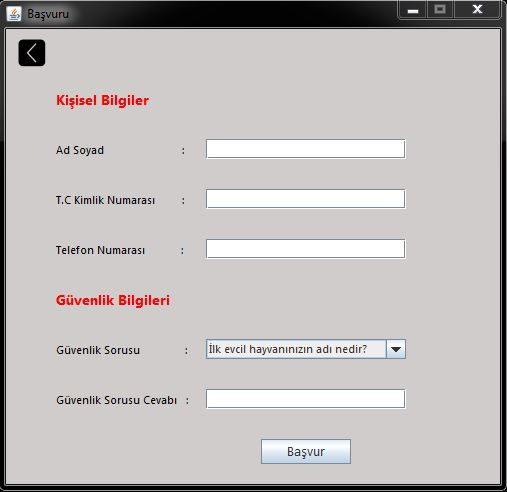
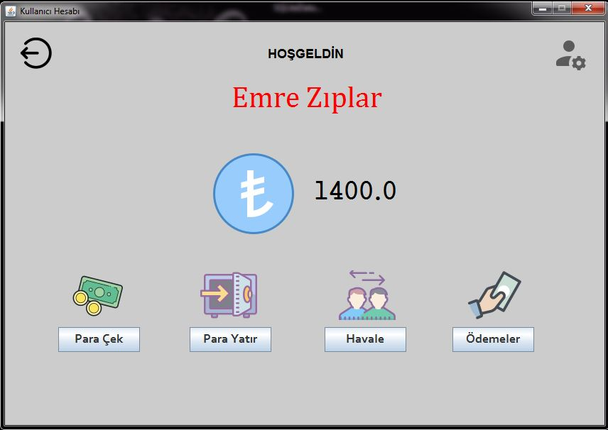

# Banka Uygulaması
Banka Uygulaması **_nesne yönelimli programlama_** dersi projesi için , 
**_java swing_** ve **_sqlite_** veritabanı kullanılarak _sürükle bırak kullanılmadan_ geliştirilmiş 
ve türkçe açıklamaları bulunan bir uygulamadır.

## 🚀 Hedef
Kullanıcıların kendilerine özel hesap oluşturabilmesini ve bu hesaplarıyla para çekme , 
para yatırma , başka hesaba havale , faturalarını ödeme gibi işlemleri yapabilmelerini sağlamaktır. 

## 🔌 Kurulum 
Uygulamayı yüklemek için şu adımları izleyin.

- Sağ üstte bulunan Fork butonuna bas.
- "Clone or download" bölümünden dosyayı indir.                        
- Projeyi Netbeans'de aç.
- Son olarakta sqlite-jdbc-3.27.2.1.jar 'ının varlığını kontrol edin.

## 📸 Ekran Görüntüleri

#  İyi Çalışmalar ツ

